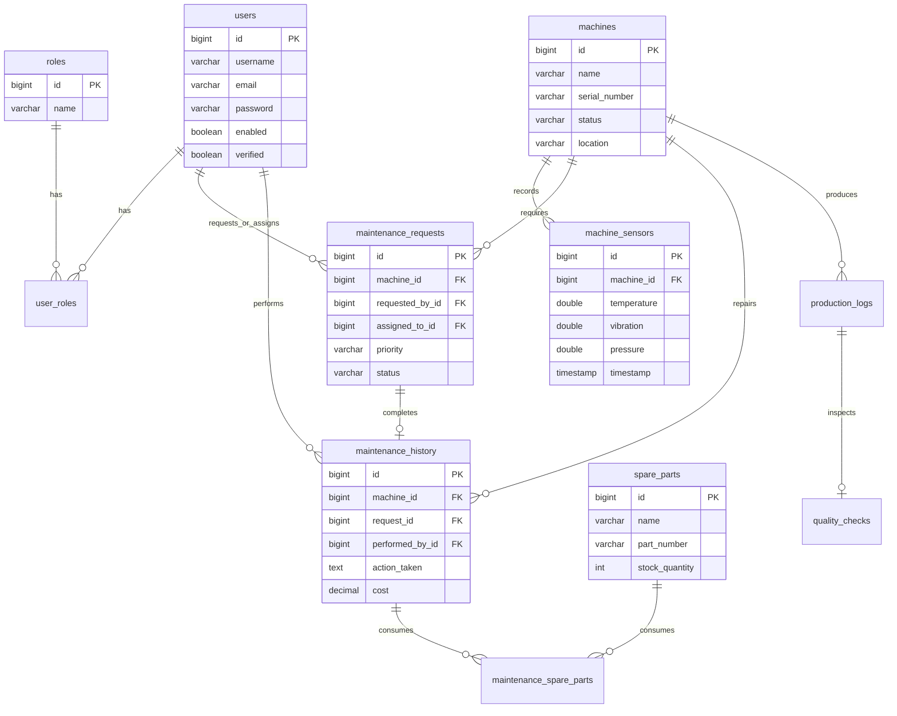
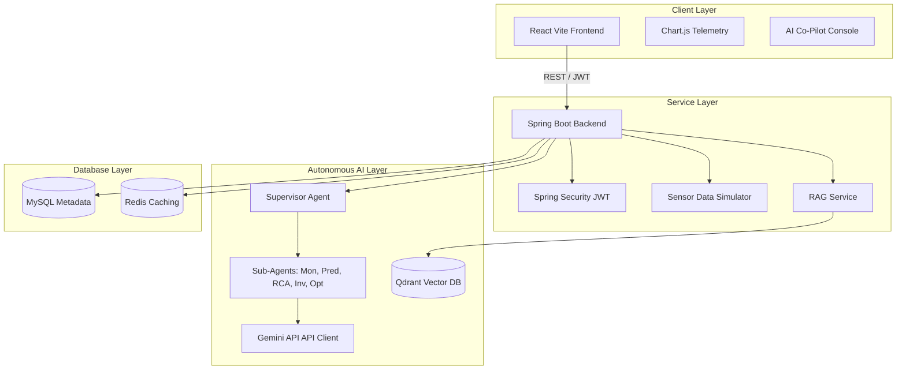

# System Diagrams - Smart Manufacturing Monitoring

This document details the architectural layouts, data schemas, and sequence structures of the system.

---

## 1. Entity Relationship Diagram (ERD)



---

## 2. Agent Coordination Sequence Diagram

This sequence illustrates the automatic workflow triggered when the background simulator pushes a thermal/vibration anomaly to the database.

```mermaid
sequenceDiagram
    autonumber
    actor Tech as Maintenance Engineer
    participant Sim as Telemetry Simulator
    participant DB as MySQL DB
    participant Sup as Supervisor Agent
    participant Mon as Monitoring Agent
    participant Pred as Predictive Maint Agent
    participant RCA as RCA Agent
    participant Inv as Inventory Agent
    participant Opt as Production Opt Agent

    Sim->>DB: Post Telemetry [Temp = 92C, Vib = 5.6]
    Note over Sim,DB: Threshold breached: Anomaly flagged!
    DB->>Sup: Push alert to Supervisor
    Sup->>Mon: Invoke: Telemetry anomaly scan
    Mon-->>Sup: Status: [Breach verified, Urgency: CRITICAL]
    Sup->>Pred: Invoke: Remaining Useful Life forecasting
    Pred-->>Sup: Status: [RUL: 140 hrs, Wear: 87%]
    Sup->>RCA: Invoke: Diagnostic & repair procedures
    RCA-->>Sup: Status: [Cause: roller friction, Need: PART-BRG-102]
    Sup->>Inv: Invoke: Inventory stock checks
    Inv-->>Sup: Status: [Part in stock: YES, Qty: 15]
    Sup->>Opt: Invoke: Safe running mitigation advice
    Opt-->>Sup: Status: [Mitigation: reduce RPM 10%, OEE impact: -6%]
    Sup->>DB: Log AI recommendation and send UI notifications
    DB-->>Tech: Display warning alert in dashboard
```

---

## 3. High-Level System Architecture Diagram


